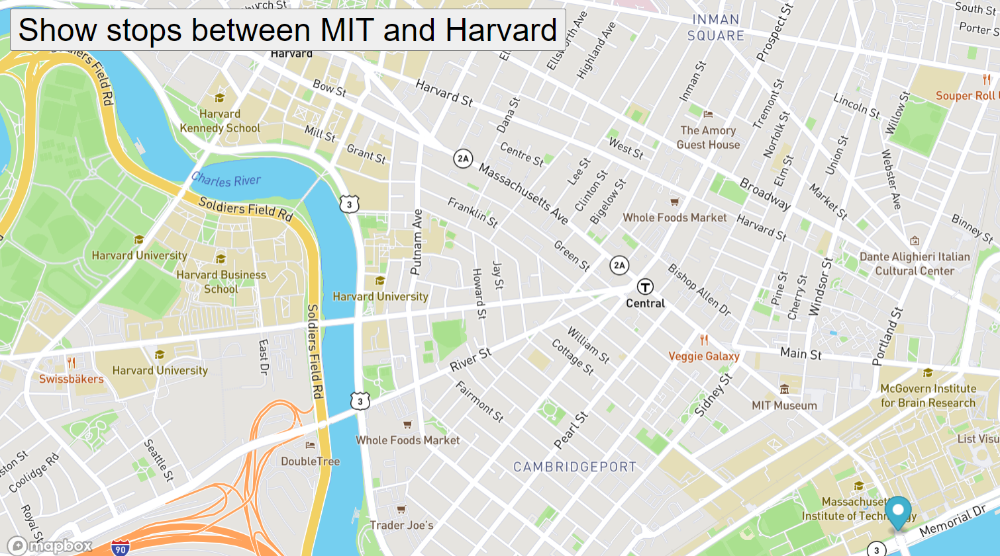

# Real Time Bus Tracker
## Description
This project is designed to move a map marker along the bus route from MIT to Harvard.
To run a copy of this project all you need to do is add you own access token on line 18.
Access token can be obtained for free by creating an account at mapbox.com.
### Future Improvements
My improvements for the future is to add an estimated time of arrival based on distance and speed.
